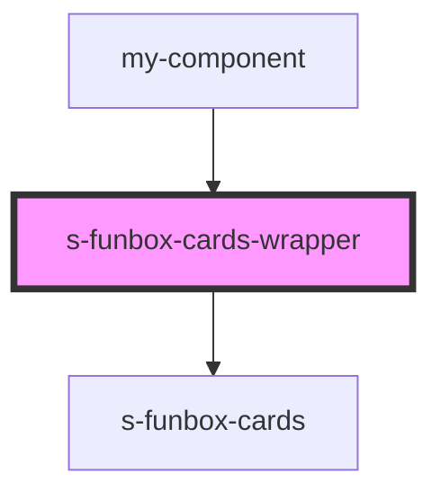

# s-funbox-cards-wrapper

<!-- Auto Generated Below -->

## Properties

| Property      | Attribute      | Description         | Type     | Default     |
| ------------- | -------------- | ------------------- | -------- | ----------- |
| `bgImage`     | `bg-image`     | Background image    | `string` | `undefined` |
| `cardContent` | `card-content` | Данные для карточки | `any`    | `undefined` |

## Dependencies

### Used by

 - [my-component](../../..)

### Depends on

- [s-funbox-cards](./res/view/s-funbox-cards)

### Graph

----------------------------------------------

*Built with [StencilJS](https://stenciljs.com/)*
