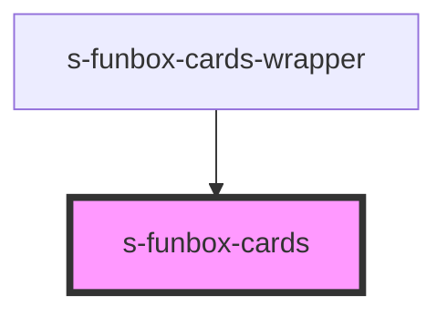

# s-funbox-cards

<!-- Auto Generated Below -->

## Properties

| Property      | Attribute      | Description         | Type  | Default     |
| ------------- | -------------- | ------------------- | ----- | ----------- |
| `cardContent` | `card-content` | Данные для карточки | `any` | `undefined` |

## Events

| Event         | Description      | Type               |
| ------------- | ---------------- | ------------------ |
| `clickOnCard` | Клик по карточке | `CustomEvent<any>` |

## Dependencies

### Used by

 - [s-funbox-cards-wrapper](../../..)

### Graph

----------------------------------------------

*Built with [StencilJS](https://stenciljs.com/)*
